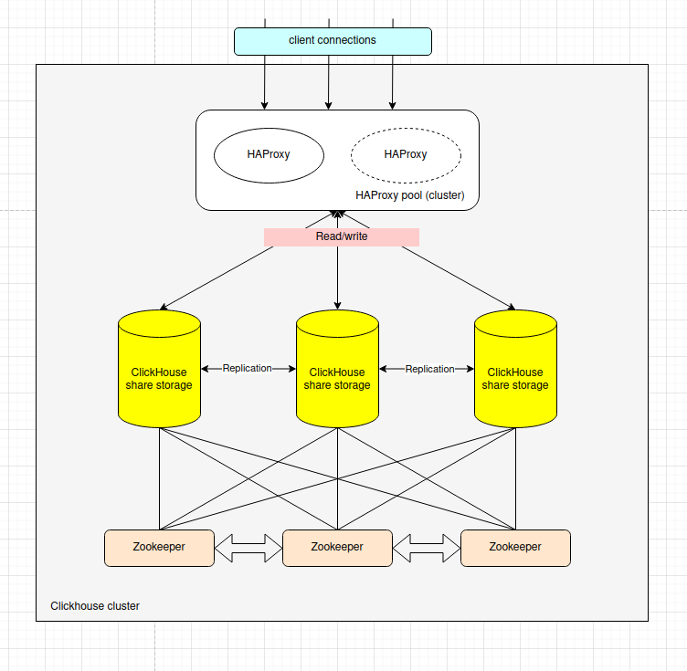

## Развертывание отказоустойчивого кластера Clickhouse

## Теория

**Zookeeper** отвечает за хранение и координацию метаданных, таких как состояние таблиц, блоки данных и распределение задач между узлами кластера. Это необходимо для синхронизации операций между узлами.

Координирует репликацию.

Выбирает ведущий узел.

Управляет блокировками.

Zookeeper запускается на каждой ноде (сервере) кластера, или же используется выделенный кластер Zookeeper для всех нод.

**Clickhouse** 

Если у вас есть несколько реплик одного сегмента данных, запись будет происходить только на одну основную реплику, после чего изменения распространяются на другие ноды с помощью механизма репликации.
    Для того чтобы отправить данные на запись, клиент должен обращаться к основному узлу для соответствующего набора данных.

В случае выхода основной реплики из строя, другая реплика может стать ведущей (в зависимости от настроек кластера), и она будет обрабатывать операции записи до тех пор, пока не восстановится первоначальный мастер.

## Развертывание