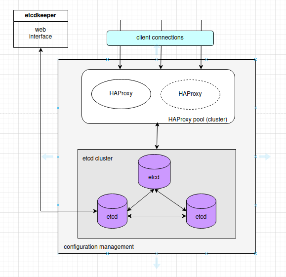

## Развертывание DCS (Distributed Configuration System) — распределённая система хранения конфигурации

## Теория

Конфигурационные данные хранятся в etcd кластере. 

Должно быть нечетное кол-во нод, в нашем случае три.

etcd - мультимастер, то есть писать данные можно в любую ноду и они реплицируются по остальным нодам.

В какую ноду писать - выбирает балансировщик HAProxy. Алгоритм round robin. В случае падения etcd ноды HAProxy исключит эту ноду из списка до ее восстановления.

На случай падения HAProxy есть дублирующий экземпляр. Переключение на него нужно будет реализовать в клиенте. Есть вариант с Keepalived, но это слишком замороченно.

Для внесения конфигурационных данных в базу используется web-клиент Etcdkeeper. Доступ к нему по паролю.

---
## Развертывание
### Версия с TLS сертификатами

#### Запускаем плейбук в директории etcd-ansible/playbook.yaml

    $ ansible-playbook playbook.yaml

Запросит пароль для root пользователя.

#### Устанавливаем web клиент.  Запускаем плейбук в директории etcdkeeper-ansible/playbook.yaml

Клиент будет доступен по адресу http://<IP_ноды_с_клиентом>:8088/etcdkeeper/

Потребуется ввести пароль, указанный на шаге 1.

### Версия без TLS сертификата (простая)

#### Запускаем плейбук в директории etcd_nosecure/playbook.yaml

    $ ansible-playbook playbook.yaml

#### Устанавливаем web клиент.  Запускаем плейбук в директории etcdkeeper_nosecure/playbook.yaml

Клиент будет доступен по адресу http://<IP_ноды_с_клиентом>:8088/etcdkeeper/

