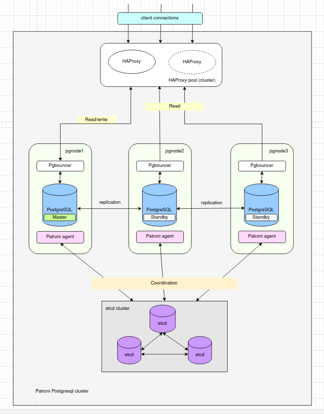

## Развертывание отказоустойчивого кластера Postgresql

## Теория

Кластер строится на основе следующих компонентов:
- HAProxy - балансировщик
- Pgbouncer - пулер соединений к базе Postgresql
- Patroni - менеджер кластера Postgresql, управляющий репликациями и failover (аварийными переключениями) мастер-реплика
- Postgresql - собственно сама база данных
- etcd - распределенное хранилище конфигураций

---
## Развертывание 

1. Предварительно должен быть развернут etcd кластер управления конфигами (директория etcd-ansible + etcdkeeper-ansible). Как это сделать смотри в readme_dcs.md

2. В директории postgres_cluster_ansible запускаем плейбук:

    
    $ ansible-playbook playbook.yaml

Будут развернуты patroni, postgresql и pgbouncer

3. В директории haproxy_ansible запускаем плейбук:

    
    $ ansible-playbook playbook.yaml

Будет развернут балансировщик HAProxy.

Через один порт балансировщика будет вестись работа с мастером, а через другой с репликами. 

Одинаковые балансировщики можно развернуть на нескольких нодах и в случае падения одной - работать можно будет через другую.

Переключение между этими нодами можно делать через keepalived (что сложнее) или в нашем случае нужно написать модуль переключения в клиентских программах на Go.

