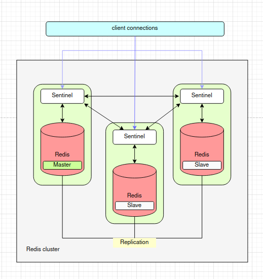

## Развертывание отказоустойчивого кластера Redis

## Теория

Redis Sentinel - посредник отслеживающий работоспособность Redis нод и переназначающий мастера в случае его падения.

Golang клиент подключается к Redis через Sentinel. Перенаправление запросов на нужную ноду происходит автоматически.

Поэтому тут не используем HAProxy, хотя это возможно.

## Развертывание

1. Запускаем плейбук 

      
    $ ansible-playbook playbook.yaml

Будут установлены Redis и Redis Sentinel.